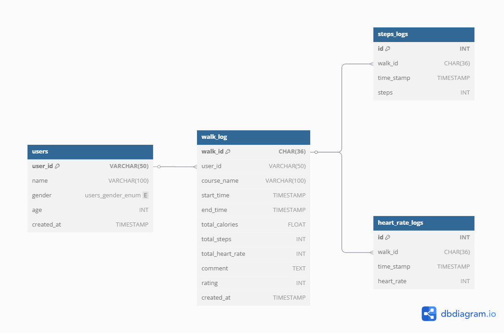
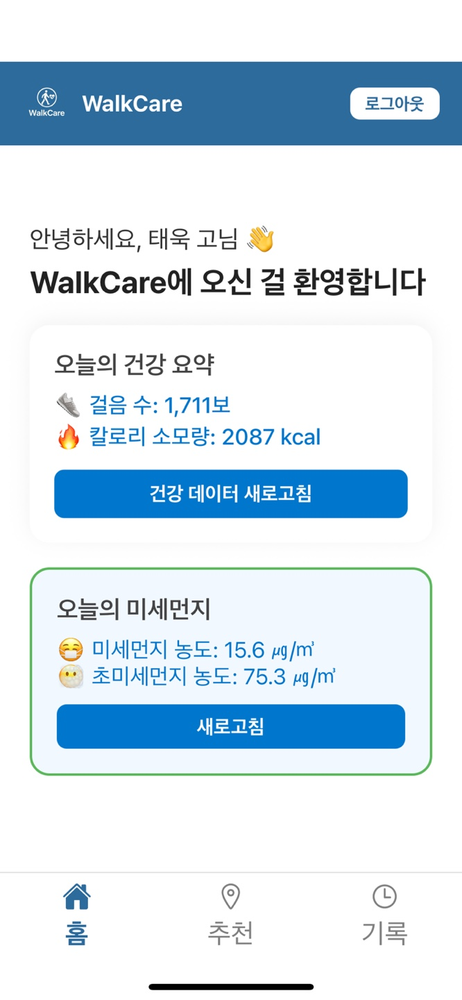
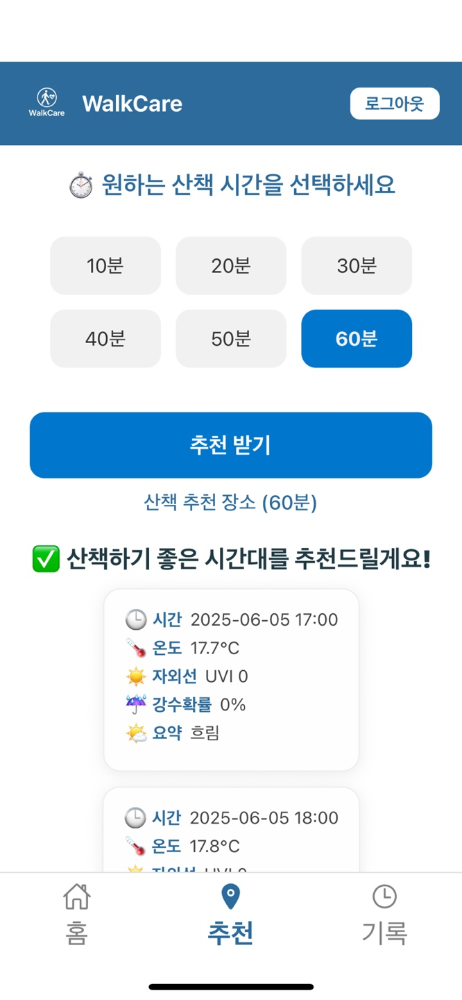
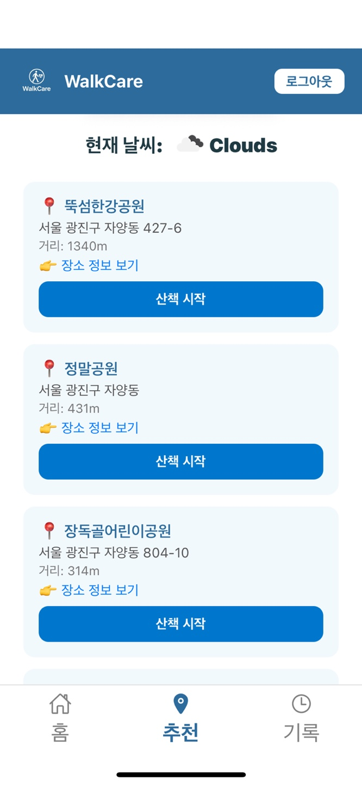
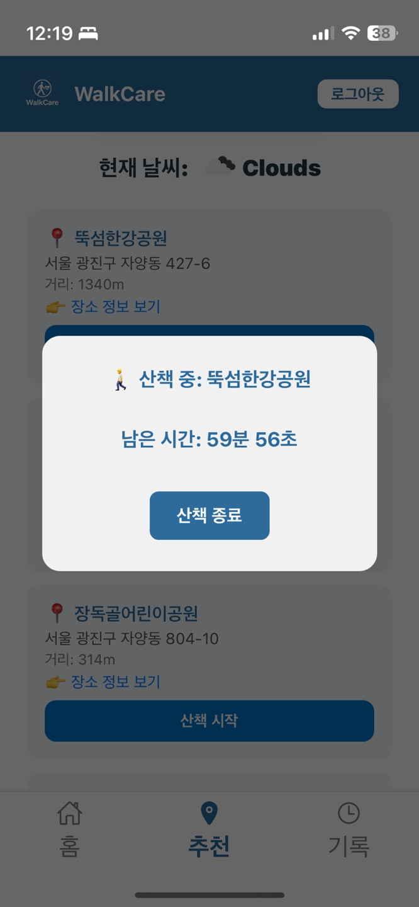
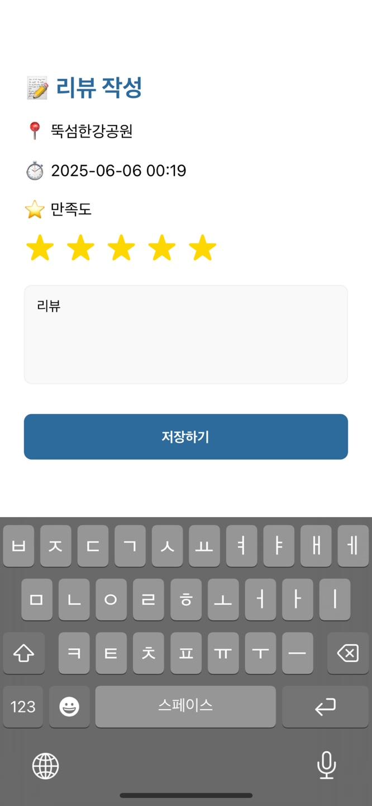
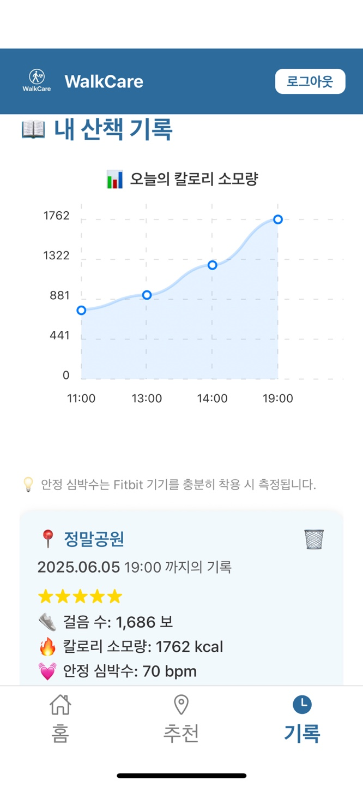

# 🚶‍♀️ WalkCare – 개인 맞춤형 산책 추천 서비스

WalkCare는 개인의 건강 데이터(Fitbit)와 실시간 환경 데이터(IoT)를 융합해  
사용자에게 **최적의 산책 시간과 장소**를 추천하는 스마트 헬스케어 앱입니다.

> ✨ 실시간 센서 + 머신러닝 + 서버리스 아키텍처 기반 클라우드 IoT 서비스
---

## 🧠 프로젝트 개요

- **프로젝트명**: WalkCare
- **목표**: 건강 정보와 외부 환경을 통합해 개인에게 맞는 산책 시간과 장소를 추천
- **기대효과**:
  - 사용자 맞춤형 건강 관리
  - 날씨·미세먼지 등 환경 반영한 스마트 추천
  - AWS 기반 IoT & ML 시스템 구축 경험

🔗 **시연 영상**: [YouTube 링크](https://youtu.be/edvwnAalQ0o)

---

## 🧱 시스템 아키텍처

 

- Fitbit OAuth2 인증으로 사용자 생체 데이터 수집 (심박수, 걸음 수, 칼로리)
- Raspberry Pi → AWS IoT Core → Lambda → DynamoDB로 미세먼지 정보 실시간 저장
- 머신러닝 모델(Random Forest)은 Docker 컨테이너로 배포되어 예측 수행
- React Native 앱에서 사용자 인터페이스 제공

---
## 🗄️ RDBMS 설계

 

---

## 🔑 주요 기능 요약

| 기능 | 설명 |
|------|------|
| 📲 Fitbit 연동 | OAuth2 인증 및 생체 데이터 수집 |
| 🌫️ 환경 센서 연동 | 라즈베리파이 → MQTT → AWS IoT Core |
| 🧠 산책 시간 추천 | ML 모델로 건강 + 환경 기반 추천 |
| 🗺️ 산책 장소 추천 | 소요 시간 기반으로 근처 장소 탐색 |
| 📝 리뷰 기록 | 산책 후 감정·별점 기록 및 시각화 |
| 📱 모바일 앱 | 실시간 상태 확인 및 추천 결과 제공 |

---
## 🛠️ 기술 스택 및 구성 요소
| 구성 요소 |	기술 |
|------|------|
| 프론트엔드 |	React Native, Expo |
| 백엔드	| Node.js, Express (개발), API Gateway, AWS Lambda (운영) |
| 인증 |	Fitbit OAuth2 |
| IoT 처리 |	Raspberry Pi, AWS IoT Core, MQTT |
| 데이터베이스 |	DynamoDB (센서/토큰), RDS(MySQL – 리뷰/기록) |
| 머신러닝 |	Scikit-learn, RandomForest, Docker, Amazon ECR |
| API 연동 |	Fitbit API, OpenWeather API, Kakao Map API |

---

## 📱 모바일 UI

<table>
  <tr>
    <td align="center">
       
      <strong>홈 화면</strong>
    </td>
    <td align="center">
       
      <strong>산책 시간대 추천</strong>
    </td>
    <td align="center">
       
      <strong>산책 장소 추천</strong>
    </td>
  </tr>
  <tr>
    <td align="center">
       
      <strong>카운트다운</strong>
    </td>
    <td align="center">
       
      <strong>리뷰 작성</strong>
    </td>
    <td align="center">
       
      <strong>기록 조회</strong>
    </td>
  </tr>
</table>

